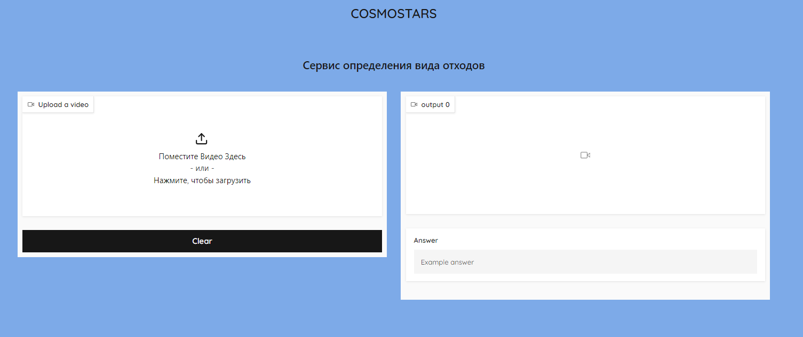
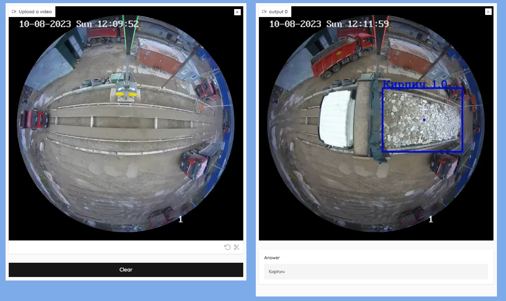

# Сервис детекции кузова самосвала и мониторинга отходов

## Запуск сервиса (linux, docker)  

1. Клонируйте репозиторий
2. Скачайте веса обученных нейросетей(https://disk.yandex.ru/d/qWR2b2iz-KiXeA) и положите в директорию services/weights/
3. Соберите и запустите контейнер:
```bash
docker-compose up --build
```
4. После запуска сервис будет доступен по адресу `http://localhost:8001/`





## Подготовка данных, Обучение и инференс моделей

1. Установите и запустите виртуальное окружение:
```bash
python3 -m venv venv
source venv/bin/activate
```
2. Установите необходимые библиотеки:
```bash
pip3 install -r requirements.txt
```
3. Подготовка данных для обучения:  
    - Скачайте и положите данные для классификатора(были выданы кейсодержателем) в директорию data/ (структура data/train/class_name/videos.mp4)
    - Скачайте и положите данные для детектора кузова(разметили сами: https://disk.yandex.ru/d/dOOnDUaB5MVBdg) в директорию data/ (структура data/train_cars/class_name/images.jpg(.txt))
    - Поменять пути(при необходимости) и запустить файл: `python data_preparetion.py`

4. Обучение моделей:  
    - Для обучения моделей и вырезания кропов кузова используется файл train.py
    - Для запуска поменяйте необходимые пути, раскомментируйте нужную функцию и запустите файл: `python train.py`
    - train_detector() - обучение детектора кузова (все результаты сохраняются в папку runs/detect/train)
    - predict_detector() - вырезания кузова на фото (все результаты сохраняются в папку runs/detect/predict)
    - train_classifier() - обучение классификатора отходов (все результаты сохраняются в папку runs/classify/train)

5. Последовательность запуска:  
    - Запустить подготовку данных
    - Обучить детектор кузова (train_detector)
    - Обучить классификатор на полных изображениях
    - Получить кропнутые фото кузова для каждого из 4 классов (predict_detector)
    - Положить кропнутые фото для каждого класса в директорию data/train_frames_crop/
    - Запустить get_train_val() из файла с подготовкой данных, передав путь data/train_frames_crop/
    - Обучить классификатор на кропнутых кузовах

5. Инференс моделей
    - Скачайте и положите тестовый датасет в директорию data/ (структура data/test/videos.mp4)
    - Скачайте веса обученных нейросетей(https://disk.yandex.ru/d/qWR2b2iz-KiXeA) и положите в директорию services/weights/
    - Запустите скрипт: `python inference.py`
    - По окончанию работы скрипта результаты предсказаний сохранятся в коре в файле submission.csv
